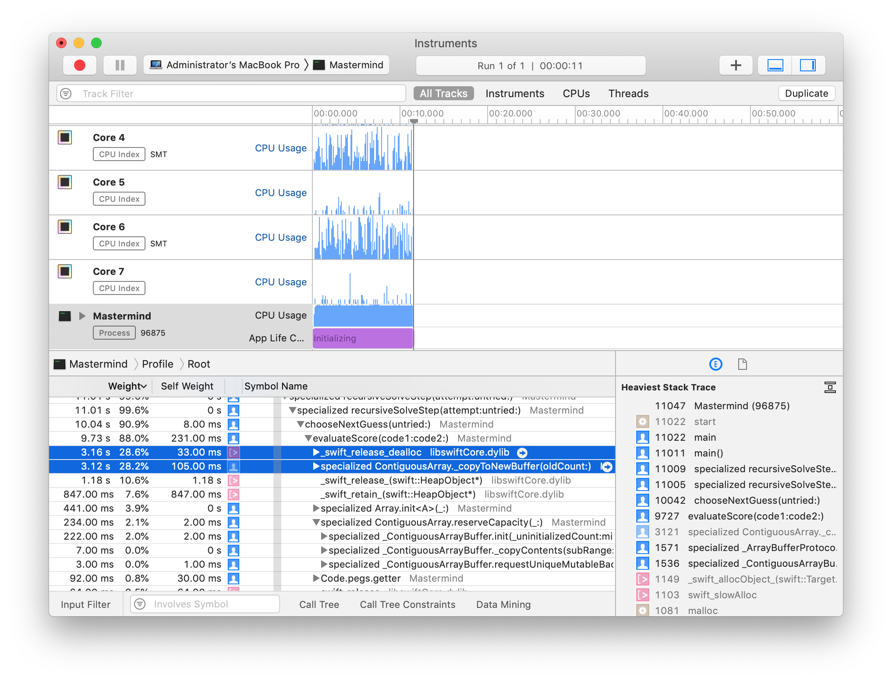

# Description

Swift implementation of Knuth's algorithm to solve Mastermind within 5 guesses.

# TODO

* ~~Modes of operation:~~
  * ~~using a single thread~~
  * ~~using multiple threads~~
  * ~~using a Metal compute shader~~

# Original Results

My original results typically looked as follows:

| Build | Mode | Duration |
| ----- | ---- | -------- |
| Debug | --single-thread | 177,202ms |
| Debug | --multiple-threads | 68,155ms |
| Debug | --metal-compute-shader | 82ms |

A few days later, I happened to be playing around with a JavaScript implementation
of the same algorithm and noticed that it was much faster than the `--single-thread`
and `--multiple-threads` modes above. This made me suspicious. So I investigated and
found a few things that were slowing it down as described in the next section.

# Issues

## Debug vs Release build

My original timings used the debug build of the code.
Switching to the release build of the code yielded much better timings:

| Build | Mode | Duration |
| ----- | ---- | -------- |
| Release | --single-thread | 10,921ms |
| Release | --multiple-threads | 17,510ms |
| Release | --metal-compute-shader | 28ms |

## Re-evaluation of Computed Properties

I have a couple of computed variables - `allScores` and `allCodes` - which are used several times.
Each time they are called, they rebuild their arrays. I introduced a couple of helper functions - 
`makeAllScores` and `makeAllCodes`.

Old `allScores` code:

```swift
var allScores: [Score] {
    var scores = [Score]()
    for blacks in 0...4 {
        for whites in 0...4 {
            if blacks + whites <= 4 && !(blacks == 3 && whites == 1){
                scores.append(Score(blacks: blacks, whites: whites))
            }
        }
    }
    return scores
}
```

New `allScores` code:

```swift
func makeAllScores() -> [Score] {
    var scores = [Score]()
    for blacks in 0...4 {
        for whites in 0...4 {
            if blacks + whites <= 4 && !(blacks == 3 && whites == 1){
                scores.append(Score(blacks: blacks, whites: whites))
            }
        }
    }
    return scores
}

let allScores: [Score] = makeAllScores()
```

## Hot spot in `evaluateScore`

I found the biggest problem by profiling the code using the `Time Profiler`.



For convenience, the `Code`
struct holds the pegs as discrete fields (`p0`, `p1`, `p2` and `p3`) and as an array (`pegs`).
The `pegs` array is used a lot by `evaluateScore` in count, filter and zip operations etc.
Whilst this makes the code quite readable and expressive, it had severe performance issues.
I'm guessing that this is because it causes a lot of memory allocations and deallocations.
If `evaluateScore` was only called a couple of times, there wouldn't be any problem.
But `evaluateScore` gets called a lot of times (millions) so the inefficiencies are magnified.
I rewrote `evaluateScore` in dumber terms to eliminate the `pegs` array completely and it
resulted in a big improvement in performance.

This is the old version of `evaluateScore`:

```swift
func evaluateScore(code1: Code, code2: Code) -> Score {
    let mins = allPegs.map { peg -> Int in
        let numMatchingCode1Pegs = code1.pegs.count { $0 == peg }
        let numMatchingCode2Pegs = code2.pegs.count { $0 == peg }
        return min(numMatchingCode1Pegs, numMatchingCode2Pegs)
    }
    let sumOfMins = mins.reduce(0, +)
    let blacks = Array(zip(code1.pegs, code2.pegs)).count { $0.0 == $0.1 }
    let whites = sumOfMins - blacks
    return Score(blacks: blacks, whites: whites)
}
```

This is the new version of `evaluateScore` and a simple helper function, `countPegs`:

```swift
func countPegs(peg: Peg, code: Code) -> Int {
    return
        (code.p0 == peg ? 1 : 0) +
            (code.p1 == peg ? 1 : 0) +
            (code.p2 == peg ? 1 : 0) +
            (code.p3 == peg ? 1 : 0)
}

func evaluateScore(code1: Code, code2: Code) -> Score {
    let mins = allPegs.map { peg -> Int in
        let numMatchingCode1Pegs = countPegs(peg: peg, code: code1)
        let numMatchingCode2Pegs = countPegs(peg: peg, code: code2)
        return min(numMatchingCode1Pegs, numMatchingCode2Pegs)
    }
    let sumOfMins = mins.reduce(0, +)
    var blacks = 0
    blacks += code1.p0 == code2.p0 ? 1 : 0
    blacks += code1.p1 == code2.p1 ? 1 : 0
    blacks += code1.p2 == code2.p2 ? 1 : 0
    blacks += code1.p3 == code2.p3 ? 1 : 0
    let whites = sumOfMins - blacks
    return Score(blacks: blacks, whites: whites)
}
```

# Updated Results

Having fixed the above issues, typical timings now look as follows:

| Build | Mode | Duration |
| ----- | ---- | -------- |
| Debug | --single-thread | 31,910ms |
| Debug | --multiple-threads | 9,249ms |
| Debug | --metal-compute-shader | 26ms |
| Release | --single-thread | 1,063ms |
| Release | --multiple-threads | 823ms |
| Release | --metal-compute-shader | 12ms |

# Links

* [Mastermind (board game)](https://en.wikipedia.org/wiki/Mastermind_(board_game))
* [Five-guess algorithm](https://en.wikipedia.org/wiki/Mastermind_(board_game)#Worst_case:_Five-guess_algorithm)
* [Knuth's mastermind algorithm](https://math.stackexchange.com/questions/1192961/knuths-mastermind-algorithm)
* [knuth-mastermind.pdf](https://www.cs.uni.edu/~wallingf/teaching/cs3530/resources/knuth-mastermind.pdf)
